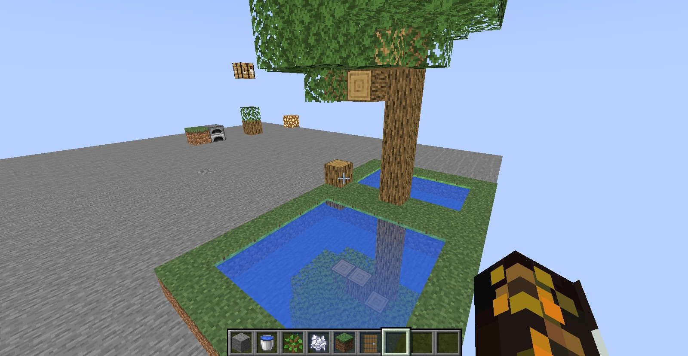

# Minecraft RTX Water Shader

This is a simple demonstration on how to implement a ray traced version of the Water Shader on Minecraft with Iris. This project was put together with the help of [taigaclaw](https://github.com/coolq1000) and his [voxelization project](https://github.com/coolq1000/vx-simple).

## Screenshot

## Voxelization

The crux of the technique is **voxelization**. By default, OpenGL or any rasterization pipeline discards as much data as possible through various techniques like: back-face culling, clipping vertices outside normalized device coodinates, depth testing, stencil testing. The goal of voxelization is to keep data around even the data outside the screen, behind the player, and blocks hidden behind others. This way, ray tracing/path tracing can be used to compute indirect illumination. We use the geometry shader in the shadow pass to activate voxelization. We store the block ID of the cube in the **shadow map**. We use a **uniform grid** as the acceleration structure as most of Minecraft's terrain is made of cubes. This trick allows us to efficiently raytrace the world data at shading time. We use the full texture atlas for shading blocks instead of the average block color as in many raytraced shaders. This way water reflections are accurate.

## Shading

Here we use a simple ray tracing technique: we cast a ray for each visible water fragment, we reflect this ray on the water. We need to query once the grid to find which block the ray collides with. Finally, we blend the obtained block color with the water color.

## Limitations

We use voxelization because we do not have access to the java code. All voxels stored through voxelization are assumed to be cubes. However, blocks like: stairs, doors, anvils, and flower pots are not directly voxelizable because they are not cubes. Entities like: pigs, cows suffer the same problem. In order to handle these edge cases, we can define a special look-up table and ray march the non-voxelizable objects.

 

We require the shadow pass to voxelize the world. It prevents us from using shadow mapping and we lose the default shading of each block. In this shader, only water reflections are depicted, but other effects like the default ambient occlusion is removed.

## Requirements

- Minecraft 1.19.4
- Iris

Project built upon [taigaclaw's voxelization technique](https://github.com/coolq1000/vx-simple).